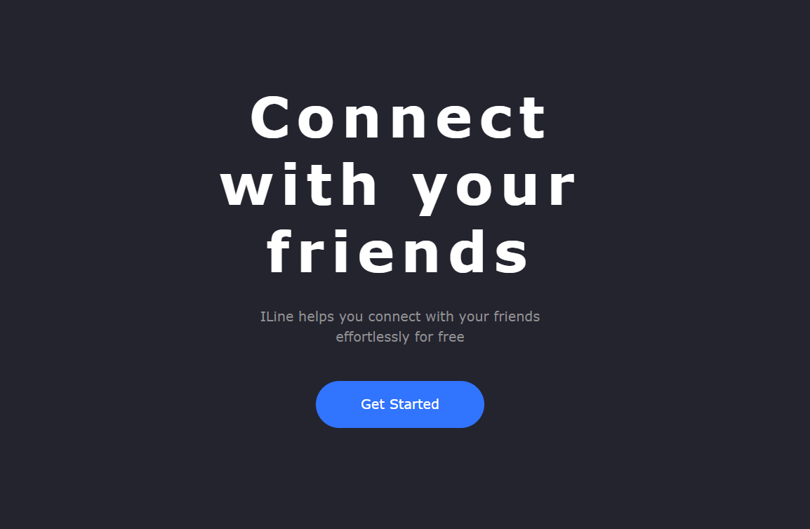

# ILine

## :beginner: Overview

this is a chat app made with next.js, react query, prisma, cloudinary, and postgresql.

[View demo](https://chat-app-phi-liard.vercel.app/)

## :camera:

## :zap: Usage

Users should be able to:

- Sign in with Google or Github
- See the list of users
- Start a conversation with another user
- See previous messages in a conversation
- Send text messages and images to the conversation

### :hammer: Built With

- [NEXT JS](https://nextjs.org/)
- [React query](https://tanstack.com/)
- [Prisma](https://www.prisma.io/)
- [Cloudinary](https://cloudinary.com/)
- [Postgresql](https://www.postgresql.org/)
- [Typescript](https://www.typescriptlang.org/)

## :star2: Acknowledgment

- [Vercel](https://vercel.com/)
- [Railway](https://railway.app/)
- [Cloudinary](https://cloudinary.com/)
